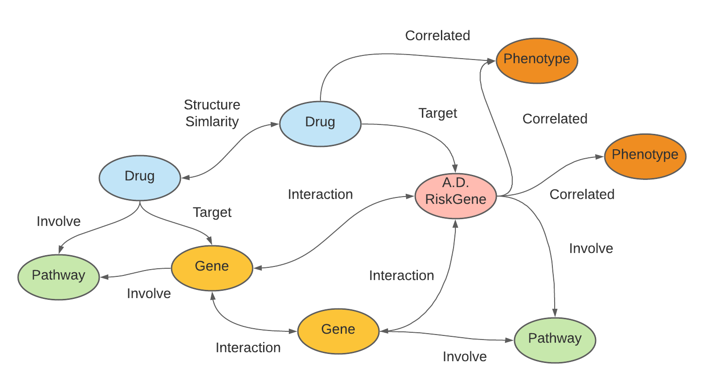

# Deep Learning for Alzheimer’s Disease Drug Repurposing using Knowledge Graph and Multi-level Evidence 
AD-KG is a comprehensive knowledge graph relating genes, drugs, pathway, and phenotypes. The knowledge graph incorporates different source informaiton (CTD, AMP-AD, STRING, Agora). We utilized those information and combine Variational Graph Auto-Encoders to train the knowledge embedding to priortize AD effective drugs and further to identify some drug combinaiton for further testing.

  
   
  <b>Figure</b>: Interactions in the AD-KG

	

# Code implementation	#
1.Please Download data from https://drive.google.com/file/d/1j0PNJglRcx7Pis3_rOtJcQTpUUsazl5K/view?usp=sharing and contact author to grant permission \
2.Please run Drug_simlarity_search and Drug_enricher_search first\
3.Please Download STRING from https://string-db.org \
4.Please Download PCGrad from https://github.com/WeiChengTseng/Pytorch-PCGrad \
5.Please run Pre_process \
6.Please run GNN_training \
7.Please run Multiple_task_reranking 

## Licence
This project is licensed under the Apache-2.0 License. However, the DRKG integrates data from many resources and users should consider the licensing of each source (see this [table](https://github.com/shuix007/COVID-19-KG/blob/master/licenses/Readme.md)) . We apply a license attribute on a per node and per edge basis for sources with defined licenses. 
